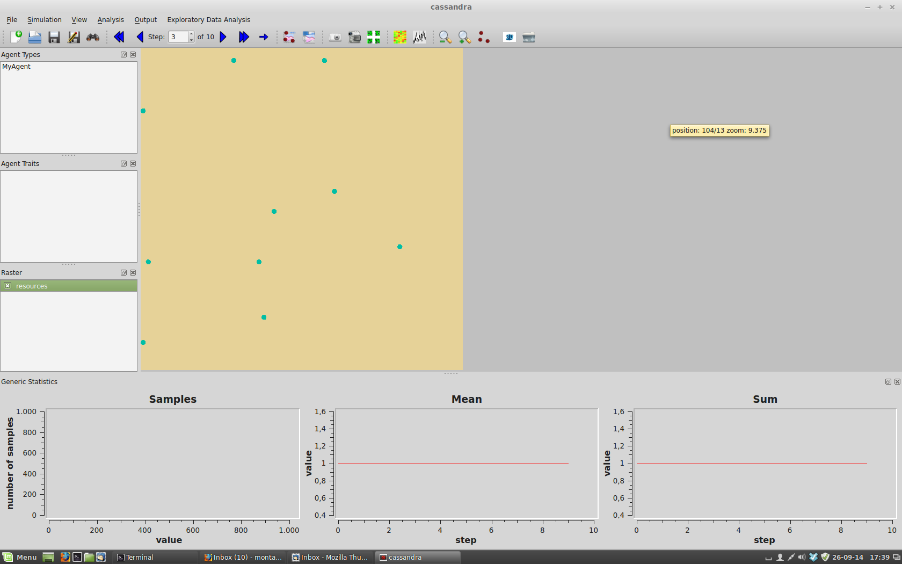
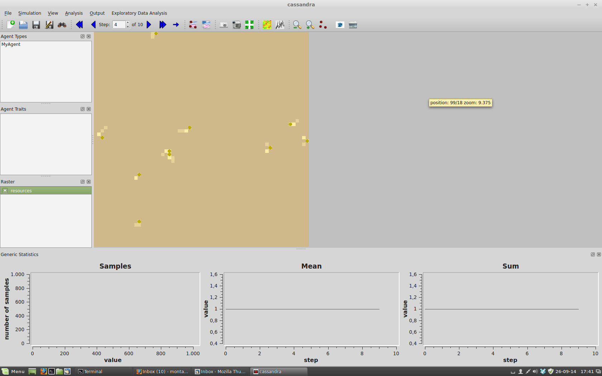

# Getting started with C++ Pandora

To begin this tutorial you will need to have Pandora installed on your computer. Take a look to the [Installation](00_installing.md) documentation if you have not make it before. It is strongly recommended to have some background on object oriented programming (preferably using C++).

We will create a simple Agent-Based Model with a basic World and a type of agents. These agents will randomly move through the World, and collect resources from the environment.

1. Create a new directory. We will store all the source code in a directory called '02_src' under 'examples', using this structure:

     - PANDORA_ROOT
  	 - examples
  		- 02_src

Alternatively you can copy the entire tutorial source from `PANDORA_ROOT/docs/tutorials/02_src` into the examples dir and work with that.

2. Create and execute a 'main' function

Next step is to create a 'main' function. This is the code that will be called once we execute the simulation, and the starting point for our model.
We create a file called `main.cxx` adding these lines into it:

Add these lines to your file:

```cpp
#include <Exception.hxx>
#include <iostream>

int main(int argc, char *argv[])
{
	try
	{	
		std::cout << "here goes the execution" << std::endl;
	}
	catch( std::exception & exceptionThrown )
	{
		std::cout << "exception thrown: " << exceptionThrown.what() << std::endl;
	}
	return 0;
}
```

We will make sure that the building system is working before continuing. Pandora uses [scons](http://www.scons.org/) to compile the code, but any other building system could be used. Copy the file `docs/code_templates/SConstruct` into your working directory and open it. We will have to modify the list of agents and source files:

  1. Check that the list of source files (variable 'srcFiles') contains only `main.cxx` file:
  	`srcFiles = Split("main.cxx")`
  2. Remove any agent name from the list 'agents':
  	`agents = ['']`
  3. Remove any agent namespace from the list 'namespaceAgents':
  	`namespaceAgents = ['']`
  4. Change the name of the program 'nameProgram':
	`nameProgram = 'tutorialPandora'`

Finally compile and execute the code:

```bash
scons
./tutorialPandora
```

The output should be something like:

```bash
$ ./tutorialPandora 
```

here goes the execution

3. Create MyWorld

Now that our building system is working we need to create our first World. We will create a class MyWorld, that inherits its functionality from a basic class called World provided by the library. MyWorld will only have a field of resources (called, obviously, 'resources').

Start defining a class MyWorld, child of World, inside a file MyWorld.hxx:

```cpp
#ifndef __MyWorld_hxx
#define __MyWorld_hxx

#include <World.hxx>

namespace Engine
{
	class Config;
}

namespace Tutorial 
{

class MyWorldConfig;

class MyWorld : public Engine::World
{
	void createRasters();
	void createAgents();

public:
	MyWorld( Engine::Config * config );
	virtual ~MyWorld();
};

} // namespace Tutorial 

#endif // __MyWorld_hxx
```


All our code will belong to a namespace called Tutorial in order to avoid any conflict. The classes that we need from Pandora belong to a different namespace, called Engine.
As you can see, we have to define 3 methods:

  1. The constructor of our class. World needs a 'Config' object where basic execution data will be stored (number of time steps, size of World), so we pass it to World's constructor. We also define a virtual destructor, and two additional pure virtual methods:
  2. createRasters is called at initialization time. Here we will define the different components of MyWorld that must be present once the execution begins.
  3. createAgents is also called at init time. It is the method where initial Agents are created and configured.

The methods are defined in a file called 'MyWorld.cxx':

```cpp
#include "MyWorld.hxx"

#include <Config.hxx>
#include <iostream>

namespace Tutorial 
{

MyWorld::MyWorld( Engine::Config * config) : World(config)
{
}

MyWorld::~MyWorld()
{
}

void MyWorld::createRasters()
{
	std::cout << "create rasters" << std::endl;
}

void MyWorld::createAgents()
{
	std::cout << "create agents" << std::endl;
}

} // namespace Tutorial 
```


We will create and configure an instance of MyWorld inside the main method (file 'main.cxx'), that now will have this code:

```cpp
#include <Exception.hxx>
#include <iostream>

#include "MyWorld.hxx"
#include <Config.hxx>

int main(int argc, char *argv[])
{
	try
	{	
		Engine::Config* myWorldConfig = new Engine::Config(Engine::Size<int>(64,64),10);
		Tutorial::MyWorld world(myWorldConfig);
		
		world.initialize(argc, argv);
		world.run();
	}
	catch( std::exception & exceptionThrown )
	{
		std::cout << "exception thrown: " << exceptionThrown.what() << std::endl;
	}
	return 0;
}
```

We create an instance of Simulation class called mySimulation. It contains two parameters needed to execute our model: the size of our world (64 by 64), and the number of time steps that the simulation will last (10). mySimulations is passed to the constructor of MyWorld, and that's it.

Finally, the 'SConstruct' file must include 'MyWorld.cxx' in the list of sourceFiles to compile:

```bash
srcFiles = Split('main.cxx MyWorld.cxx')
```

If we recompile ('scons') and execute ('./tutorialPandora') you should receive this output:

```bash
$ ./tutorialPandora 
simulation: 0 of: 1 initialized
create rasters
create agents
```

We can check that Pandora has called our two init methods (createRasters and createAgents), and 1 task (with id=0) was created. In addition, the execution should have created a directory called 'logs' with a file 'simulation_0.log', where you can follow the execution of the 10 time steps (see [tutorial log](03_logging_system.md) to understand how the Logger system works and use it in your simulations). If we take a closer look to the directory where the source is located, we will see that a new 'data' directory has been created, containing to files: 'agents-0.abm' and 'results.h5'. You can view the results of the simulation using Cassandra application (check what this app is in this document (TUTORIAL CASSANDRA).
Open cassandra (COM OBRIR CASSANDRA), and go to File->Select Simulation. Look for the directory where you are working, and select 'results.h5' from 'data' folder. You will see a yellow square of 64 by 64, and a few more things, nothing spectacular. Anyway, it is the proof that your code works and is generating something, congratulations!

4. Create some rasters

Now is time to fill MyWorld. Go to the definition of createRasters method in MyWorld.cxx, and add these lines:	

```cpp
registerDynamicRaster("resources", true);
getDynamicRaster("resources").setInitValues(0, 10, 0);
```

The first line tells World that it needs to register a new dynamic raster map (it can be modified). The first parameter states that this raster map is called resources, and the second one that it must be stored in 'results.h5' file.
The second line sets the initialized values of the entire raster map. The first two parameters are the minimum and maximum value for the entire world, and the third one is the default init value.

If you compile and execute again 'tutorialPandora', and check 'results.h5' with cassandra you will realize that a 'resources' raster map has been created. Try to 'play' the simulation; the default behavior for a raster map is to increate the value of each cell 1 unit until reaching the maximum value, so if you check the step number 9 you can check that every cell has a value of '9' by leaving your cursor on a different cell.  


5. Define MyAgent

Now that MyWorld is working we will need to define our own MyAgent. Start declaring MyAgent as a child class of Agent, in a file called 'MyAgent.hxx':

```cpp
#ifndef __MyAgent_hxx__
#define __MyAgent_hxx__

#include <Agent.hxx>
#include <string>

namespace Tutorial
{

class MyAgent : public Engine::Agent
{
public:
	MyAgent( const std::string & id );
	virtual ~MyAgent();
	
	void updateState();
	void serialize();
};

} // namespace Tutorial

#endif // __MyAgent_hxx__
```

This class will have four methods:
	1. The constructor, just like we did with MyWorld. It only gets one parameter, a string that will be used as the 'id' of the agent. This attribute is very important: every instance of Agent must have a unique id. If this is not the case, Pandora will be confused about which agent is every instance.
	2. The virtual destructor.
	3. updateState - This method is the core of a simple Pandora Agent. It is executed every time step, and is the place where the internal state of Agent is modified.
	4. serialize - In order to analyze the results, we will need to store part of the internal state of an Agent every time step. This is done in this method, but it will be empty by now. By default, Pandora always serializes the id and position of an agent so we don't need to do that. Additionally, a variable called 'exists' that checks whether this agent is alive.

You will also to create the definition file (`MyAgent.cxx`) as:

```cpp
#include "MyAgent.hxx"
#include <iostream>

namespace Tutorial
{

MyAgent::MyAgent( const std::string & id ) : Agent(id)
{
}

MyAgent::~MyAgent()
{
}

void MyAgent::updateState()
{
	std::cout << "updating state for agent: " << this << std::endl;
}

void MyAgent::serialize()
{
}

} // namespace Tutorial
```


We will have to tell the building system that our system will have a new agent, called MyAgent, and the MyAgent.cxx needs to be compiled, modifying these lines in the 'SConstruct' file:

```bash
agents = ['MyAgent']
namespaceAgents = ['Tutorial']

srcFiles = Split('main.cxx MyWorld.cxx MyAgent.cxx')
```

If you compile ('scons') this code and check the file 'MyAgent.hxx', you will see that some lines were added to your code:

```cpp
////////////////////////////////////////////////
// This code has been automatically generated //
/////// Please do not modify it ////////////////
////////////////////////////////////////////////
MyAgent( void * );
void * fillPackage();
void sendVectorAttributes(int);
void receiveVectorAttributes(int);
////////////////////////////////////////////////
//////// End of generated code /////////////////
////////////////////////////////////////////////
```

Don't touch these lines! They are generated by Pandora when the system recognizes a new Agent header for the first time, and are used by the automated parallel system. For the moment you don't have to worry about them.

6) Define behavior

We will write some basic code inside updateState to modify its state. For now we will basically move our Agents randomly through the space defined in MyWorld. Modify the file MyAgent.cxx as follow:

```cpp
void MyAgent::updateState()
{	
	std::cout << "updating state for agent: " << this << std::endl;
	Engine::Point2D<int> newPosition = _position;
	newPosition._x += Engine::GeneralState::statistics().getUniformDistValue(-1,1);
	newPosition._y += Engine::GeneralState::statistics().getUniformDistValue(-1,1);

	if(_world->checkPosition(newPosition))
	{
		setPosition(newPosition);
	}
}
```

You can see that we have created a local variable called 'newPosition'. It is initialized to the current location of `MyAgent (_position)`, but we modify randomly these values with a value going of -1, 0 or 1. Finally, we check if the position is correct in terms of MyWorld (to ensure that it is inside boundaries), and we call the method 'setPosition' with the new location. It is worth to note that newPosition is an instance of class Point2D<int>, so we have to add this class to our includes:

```cpp
#include <Point2D.hxx>

As well as the statistics package. It is part of GeneralState, a singleton class that any Pandora simulation has (a singleton class has only one instance for a execution, and can be called from any place in the code).

#include <GeneralState.hxx>
#include <Statistics.hxx>
```

7) Creating agents
We have everything ready for our first Agent-Based Model, but we have to create some instances of our brand new little MyAgent class. As stated before, we will add them in the 'createAgents' method of MyWorld:

```cpp
void MyWorld::createAgents()
{
	std::cout << "create agents" << std::endl;	
	for(int i=0; i<10; i++)
	{
#		if((i%getNumTasks())==getId())
		{
			std::ostringstream oss;
			oss << "MyAgent_" << i;
			MyAgent * agent = new MyAgent(oss.str());
			addAgent(agent);
			agent->setRandomPosition();
		}
	}
} 
```

We are creating 10 agents (called MyAgent_0, MyAgent_1, until MyAgent_9), adding them to the World, and setting initial positions for all of them. This line:

```cpp
if((i%getNumTasks())==getId())
```

it is important if you are working on a distributed environment. For example, if you execute this simulation using 4 computer nodes the first agent (MyAgent_0) would go to the first computer node (numbered 0), the second one to another (MyAgent_1 to 1), etc.

Finally MyAgent declaration must be included in MyWorld.cxx:

```cpp
#include "MyAgent.hxx"
```

Everything ready! If we compile and execute again 'tutorialPandora' we will get a list of messages communicating us that 10 agents have been created, and a sequence of 'updateState' and 'serialize' methods have been executed. If we check 'results.h5' with cassandra we should see something like Figure 2 


8) Gathering resources
To finish this tutorial we will modify MyAgent to gather 'resources' from MyWorld, and serialize this value. We go again to the 'updateState' method and add these lines:

```cpp
void MyAgent::updateState()
{
	std::cout << "updating state for agent: " << this << std::endl;
	Engine::Point2D<int> newPosition = _position;
	newPosition._x += Engine::GeneralState::statistics().getUniformDistValue(-1,1);
	newPosition._y += Engine::GeneralState::statistics().getUniformDistValue(-1,1);

	if(_world->checkPosition(newPosition))
	{
		setPosition(newPosition);
		_gatheredResources += _world->getValue("resources", _position);
		_world->setValue("resources", _position, 0);
	}
}
```

First of all, we will get the value of 'resources' from MyWorld, in the cell we recently moved. This is added to `_gatheredResources`, an attribute where the total value of resources gathered during the simulation is stored. This cell is set to 0 in raster map 'resources' of MyWorld
We also have to define this gatheredResources attribute in the declaration (MyAgent.hxx):

```cpp
class MyAgent : public Engine::Agent
{
	int _gatheredResources;

and define its value as 0 at construction time, in MyAgent.cxx:

MyAgent::MyAgent( const std::string & id ) : Agent(id), _gatheredResources(0)
{
}
```

Finally we want to store the value of `_gatheredResources` each time step, in order to check it in Cassandra. We have to do two things:

   1. Declare the method as an integer attribute inside Pandora system. We have to declare a new method called 'registerAttributes', where we will need to record which attribute will be stored during the simulation. To do that, declare the method as public inside the class, in MyAgent.hxx:

```cpp
class MyAgent : public Engine::Agent
{
	int _gatheredResources;
public:
	MyAgent( const std::string & id );
	virtual ~MyAgent();
	void registerAttributes();

	and record the attribute as integer in MyAgent.cxx:

void MyAgent::registerAttributes()
{
	registerIntAttribute("resources");
}
```

   2. serialize the attribute in serialize method:

```cpp
void MyAgent::serialize()
{
	serializeAttribute("resources", _gatheredResources);
}
```

You can compile and execute the simulation, and check that agents collect resources from the world and accumulate them from time step to time step, as can be seen in figure 3 



Congratulations, you have created your first Agent-Based Model using Pandora!

[Next - Log System](03_logging_system.md)
